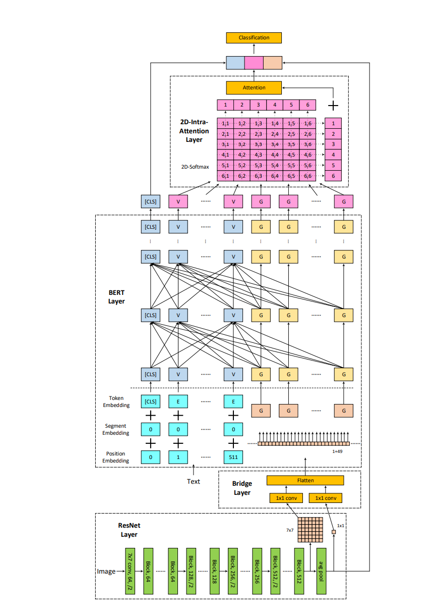
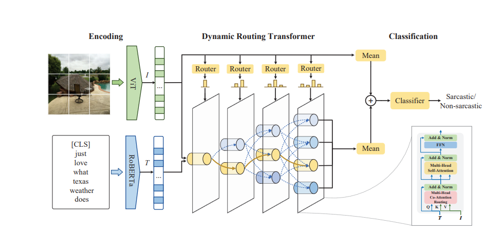
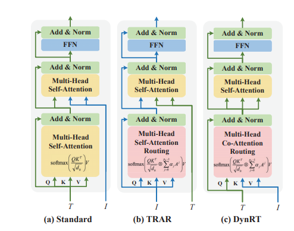
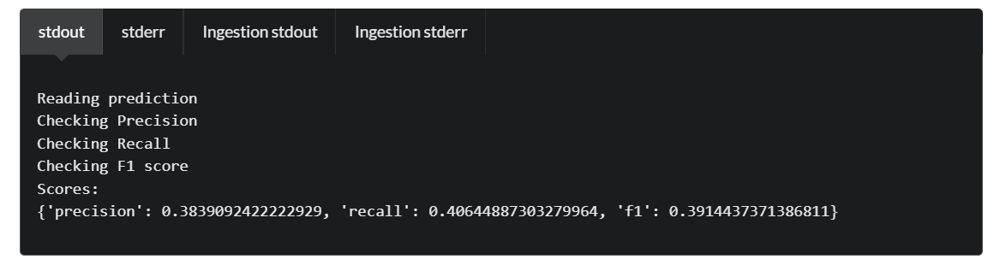
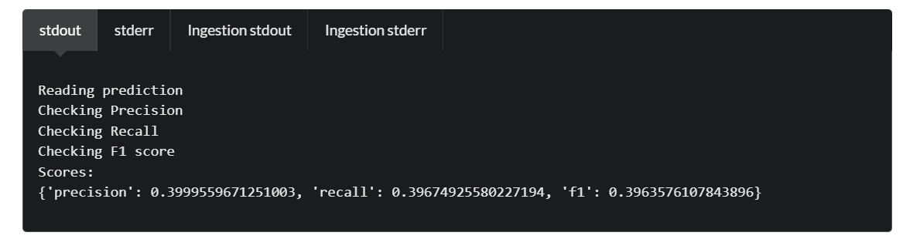

## A. Về ý tưởng:
Có 2 ý tưởng chính:
### 1. Kết hợp xử lí chung:
- Xây dựng model để phân loại cả 4 (như việc xài qwen, ViT_Phobert.py... :v)

### 2. Tách thành xử lí các binary classification:
*Ý tưởng này mới gần giống của Thông thôi (do thời gian quá trôn nên làm đơn giản), nếu được thì có thể đọc lại ý tưởng của Thông rồi thay đổi*.
Train các model binary classification rồi kết hợp kết quả lại mới nhau:
- Model **multi-not** classification
- Model **text-not** classification
- Model **image-not** classfication

Sinh kết quả của các model cho bộ test. Sau đó kết hợp với quy tắc:
- Lấy kết quả của model **multi-not** làm base.
- Nếu ở test đó model **image-not** dự đoán **image-sarcasm** 
    - Nếu model **multi-not** dự đoán multi-sarcasm: giữ nguyên kết quả
    - Nếu không:
        - Nếu model **text-not** dự đoán text-sarcasm: chuyển thành **multi-sarcasm**
        - Nếu không: chuyển thành **image-sarcasm**
- Nếu ở test đó model **text-not** dự đoán **text-sarcasm**:
    - Nếu model multi-not dự đoán multi-sarcasm: giữ nguyên kết quả
    - Nếu không: chuyển thành **text-sarcasm**

## B. Về training model:
### I. Sử dụng bridge layer (kết quả không tốt)
#### 1. Sơ lược:
Link paper: https://aclanthology.org/2020.nlpbt-1.3.pdf

Về cơ bản thì ý tưởng của thằng này là lấy feature_extractor từ model xử lí image, tạo một bridge layer và truyền cho thằng text model xử lí rồi đến 2D-Intra-Attention Layer xử lí cuối cùng.

Mới chỉ xử lí cái add bridge layer rồi ra kết quả luôn, thì thấy là có vẻ thằng này không được tốt, hoặc có thể là do implement chưa đúng, ae có thể tìm hiểu cái này.

#### 2. Kết quả:
- Mới chỉ áp dụng cho ý tưởng 2 (tách thành xử lí các binary classification), đều thấp hơn nhiều so với kết quả ban đầu của model từ Vit_PhoBert.py (hình như chỉ có 0.35 trở xuống). Xem file ***summary-results-add-bridge-layer.json***

#### 3. Code:
- Ý tưởng 2 (tách thành xử lí các binary classification)
    - Training: **model_add_bridge_layer.py**
    - Sinh kết quả: ae tham khảo **testing/test_PhoBert.py** hay mấy file khác trong folder testing r nhờ copilot gen chứ tôi để đâu quên rồi :v

### II. Sử dụng dynamic routing transformer (DynRT): kết quả tăng 1.35%
#### 1. Sơ lược
Link paper: https://aclanthology.org/2023.acl-long.139.pdf

- Ý tưởng này lại phát triển từ một paper khác (cái hình (b) TRAR - Transformer Routing), ae chắc nên đọc từ đây (dù tôi cũng chưa đọc :D)
    - Link paper: https://openaccess.thecvf.com/content/ICCV2021/papers/Zhou_TRAR_Routing_the_Attention_Spans_in_Transformer_for_Visual_Question_ICCV_2021_paper.pdf
- Ý tưởng cơ bản của thằng này (DynRT), như hình c), thực hiện cơ chế tập trung khác nhau cho từng image/caption. Khác với TRAR, chỉ tập trung trên image hoặc caption

***Vì không có nhiều thời gian, nên tôi chỉ cố gắng đọc hiểu ý tưởng rồi h\*\* diêm copilot. Ae có thời gian thì đọc kĩ paper, đọc kĩ code rồi chỉnh sửa code, tôi nghĩ có thể còn nhiều vấn đề mà mình có thể thay đổi để cải thiện (lên top 1 <("))***

#### 2. Sử dụng model này cho ý tưởng 1 (kết hợp xử lí chung):
##### a. Phương pháp
- Copilot + Claude :v
##### b. Kết quả
- Kết quả tốt nhất đạt được (best_results_full_0.39):

- Các thông số (giống multi-not model ở dưới):
    - Dropout rate: 0.1
    - Num epochs: 5
    - Batch size: 8
##### c. Code
- Model: **training/all-classification/dynrt_model.py**
- Training + testing: **training/all-classification/dynamic_routing.py**

#### 3. Sử dụng model này cho ý tưởng 2 (tách thành xử lí các binary classification): cho ra kết quả tốt nhất hiện tại
##### a. Phương pháp:
- Tôi áp dụng khá tương đồng cho mỗi model binary classification: 
    - **Multi-not** sử dụng cả PhoBert (text model) và ViT (image model)
    - **Image-not** sử dụng ViT (image model), này hình như sẽ là sẽ giống TRAR. Có sử dụng OCR để lấy text rồi cho vào PhoBert, tuy nhiên kết quả không cao + thời gian train cực lâu.
    - **Text-not** sử dụng Phobert (text model)
##### b. Kết quả:
- Kết quả tốt nhất đạt được (best_results_full+image_0.3964)

- Các thông số:
*Theo như tôi tìm hiểu thì có các thông số (các weight) có thể ảnh hưởng tới việc training model: num epochs, batch size, dropout rate, learning rate, weight decay...*
    - Với **image-not** model:
        - Dropout rate: 0.5
        - Num epochs: 30
        - Batch size: 32
        *Theo tôi cảm giác thì unbalanced data càng train nhiều càng tốt, lúc train với epochs nhỏ có lúc nó dự đoán ko ra một image-sarcasm nào. Cứ mỗi lần tăng epochs lên xong sinh kết quả nộp thì điểm recall lại tăng, và f1 thì giảm do nó sinh quá nhiều, tuy nhiên khi kết hợp với multi-not thì đã cho ra kết quả ổn. Batch size cũng có vẻ là ảnh hưởng. Theo như tìm hiểu thì có khả năng set batch size nhỏ nó học tốt hơn là batch size lớn, khá lạ là với code này set batch size như nào cũng không ảnh hưởng tới tốc độ chạy (dù số item train đã giảm)*
    - Với **multi-not** model:
        - Dropout rate: 0.1
        - Num epochs: 5
        - Batch size: 8
        *Multi not số lượng khá bằng nhau, có thể coi là balance, thì nếu tăng epochs với batch size cao hơn thì cho ra kết quả tệ hơn*
    - Với **text-not** model:
        - Mới thử nhẹ nhẹ theo thông số như image not thì kết quả là: không ra 1 text-sarcasm nào :v
##### c. Code:
- Model:
    - **Multi-not** model: **training/multi-classification/dynrt_model_multi_not.py**
    - **Image-not** model: **training/image-classification/dynrt_model_image_not.py**
    - **Text-not** model: **training/text-classification/dynrt_model_text_not.py**
- Testing + training:
    - **Multi-not** model: **training/multi-classification/dynrt_routing_multi_not.py**
    - **Image-not** model: **training/image-classification/dynrt_routing_image_not.py**
    - **Text-not** model: **training/text-classification/dynrt_routing_text_not.py**
    - Sau khi có kết quả: sử dụng file **merge_multi_image_text.py** hoặc **merge_multi_image.py** để ra kết quả cuối cùng

## C. Những thứ chưa thử:
### 1. Tập trung cho việc train model text-sarcasm?
Việc phát hiển **text-sarcasm** tất nhiên là dễ hơn với **image-sarcasm**. Nhưng mà vấn đề là bộ test và train quá ít **text-sarcasm** nên chưa đụng tới. Tuy nhiên việc train text sarcasm để hỗ trợ cho **multi-sarcasm** cũng nên được cân nhắc.
### 2. Về việc sử dụng PhoBert:
- Theo tôi thấy thì thằng hiện tại (*phobert-base-v2*) có vẻ là thằng hợp lí nhất cho mình (sử dụng cấu trức Roberta như paper...), có 1 biến thể của nó, số param nhiều gấp 3 là *phobert-large*, nhưng mà có vẻ kết quả không được tốt lắm (theo như Bảo thử :v)
### 3. Resnet hay ViT cho image?
- Tôi có thử thằng resnet50 (vì đọc paper cũng có cái xài), cơ mà có vẻ không tốt bằng ViT, nếu muốn ae có thể thử, có thể do tôi thử ng* :v.

## D. Những thứ ngoài lề
### I. Preprocess data:
- Như ae đã thấy để thực hiện cho ý tưởng 2 thì tôi có tách file train ra thành 4 file, mỗi file là một label.
- Sau đó để train cho mỗi loại model (multi-not, text-not, image-not) thì cho code chạy kết hợp (có shuffle + đánh dấu lại index cho juan :v)
- Về image-not, do unbalanced data, tôi có thử thêm data image bằng tay, chọn data từ **multi-sarcasm** (không cần đổi caption vì mình không lấy caption để train). Bằng cách này thì kết quả có tăng lên cũng 1 tí, nhưng mà do không có thời gian nên mới thêm được một ít (thêm khoảng 16 image-sarcasm). ***Xem file image_sarcasm_add_multi.json.***
### II. Scoring
- Code **scoring/scoring.py** được sử dụng khi đã có file đáp án, đưa file kết quả và file đáp án vào để tính điểm.
- Này chỉ có thể sử dụng được khi chấp nhận tách data train làm data test :v.
- Do báo nên còn 27 lần test trên Codabench, nếu mình xài hết thì có thể sử dụng cái này và tách một phần data train để thay thế việc test, nên cứ tự tin mà spam :v, bữa thử xài cách này thì kết quả này với trên Codabench không khác nhau mấy (kết quả này có lúc còn thấp hơn trên Codabench :v)

## E. Final note:
- File .gitignore tôi có ghi vào train-images, dev-images với mọi file .pth (file model) nên ae cứ bỏ image vào r tự tin train nhá :v (cơ mà chắc train trên máy tôi nên không cần lắm)
- Ae tải AnyDesk về, nào ae rảnh thì hú tôi bật máy rồi ae vào chiến, nhớ bật task manager lên ngó là được. Thấy bảo nhiệt độ GPU dưới 85 độ C là được :v.

*Cái note này được viết khá vội nên có thể có nhiều cái trôn, ae cứ pressing Bảo banh chành nha :D.*
